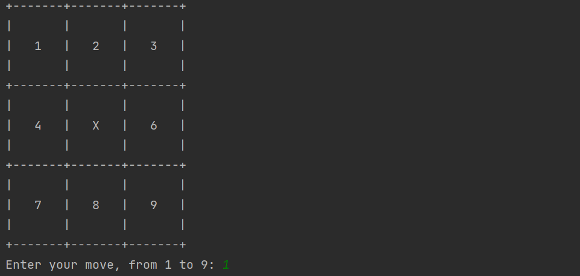
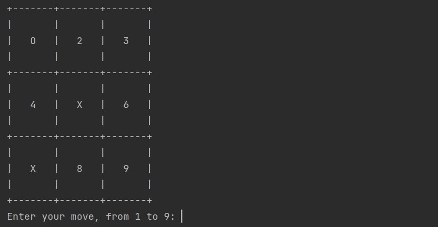
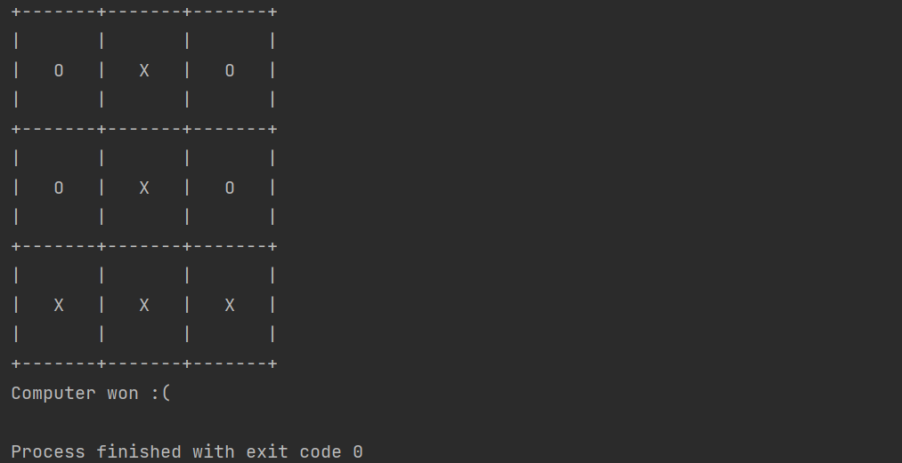

This is the simple and rudimental code I wrote in Python3 that allows the user to play Tic-Tac Toe against the computer.
The user plays with 'O', while the computer with 'X'.
The computer always puts its first move at te center of the table, as in the figure:

Then the code asks the user to input its move in an empty space, from 1 to 9.

After that, the computer plays and the table is updated, as in the figure:

At the end, there could be 3 results:
- the user wins
- the computer wins
- there is a tie

This is the example when the computer wins:
